# 続・GitHub Universe 2023 現地会場 参加・今後のIT市場考察レポート GitHub カンファレンスレポート at サンフランシスコ [2023/11/08~2023/11/09]

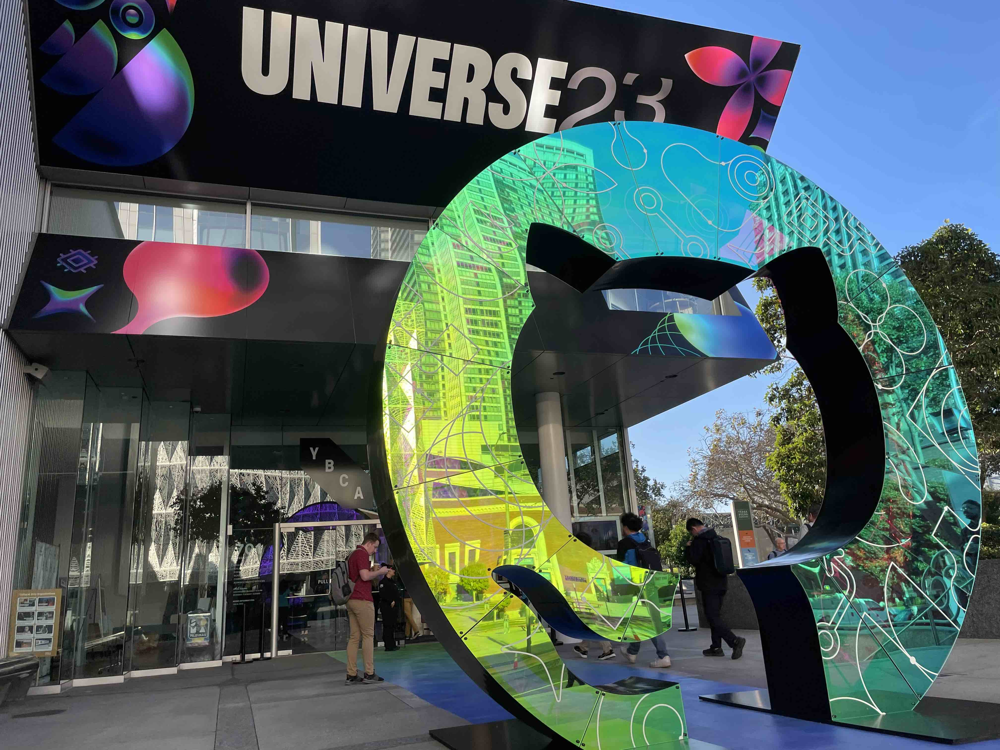

私は、2023年 11/08~11/09にサンフランシスコでGithub最大の開発者カンファレンスに参加してきました。
この記事では、 カンファレンス自体の具体的なgithubのアップデート機能についてというよりか、現地の実際に
展示してる、ITスタートアップの傾向と今後の市況予想について、感じてきたことについてを書いていきます。

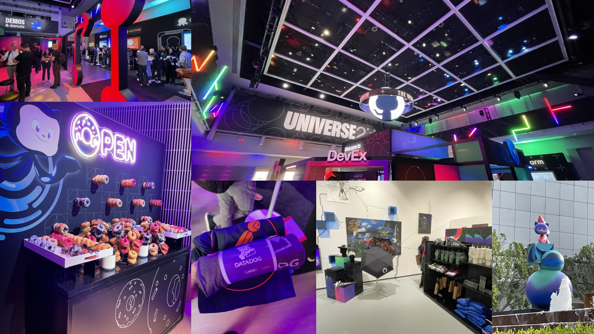

こちらの記事は、考察がメインになりますので、実際のカンファレンスの様子につきましては、別途以下のリンクにて
紹介しております。

> https://qiita.com/magisystem0408/items/de20bebfd891b3c5ba14

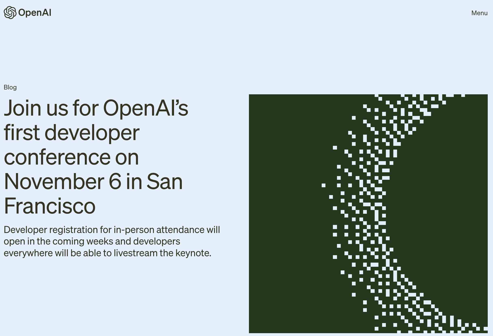
このGithub Universeの前々日に、OpenAIのカンファレンスが同じサンフランシスコで行われていて
大きくLLM(ほぼCopilotですが)に関する発表があるとGithub CEOもX(twitter)で囁いていました。

https://twitter.com/ashtom/status/1712711168207577262?t=8B5pXK1yrFC3QvIsVGO4LQ&s=19

## 今回の「LLM + GitHub連携による、セキュリティやCI/CDワークフローの自動化」がテーマだと思った
今回カンファレンスで「CopilotのUpdate」が大きな話題になっていましたが、私は、それよりも、
LLMとGitHub連携による、セキュリティやワークフローの自動化についてが、今後の開発のトレンドになると感じました。

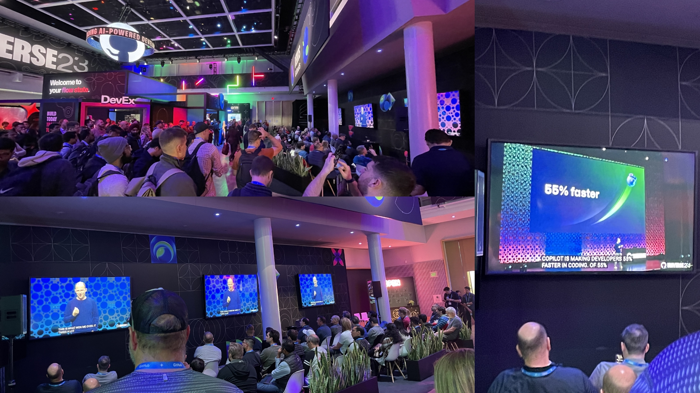

また、今回のCopilotのUpdateについても触れたいと思います。

### Hello World Masato!
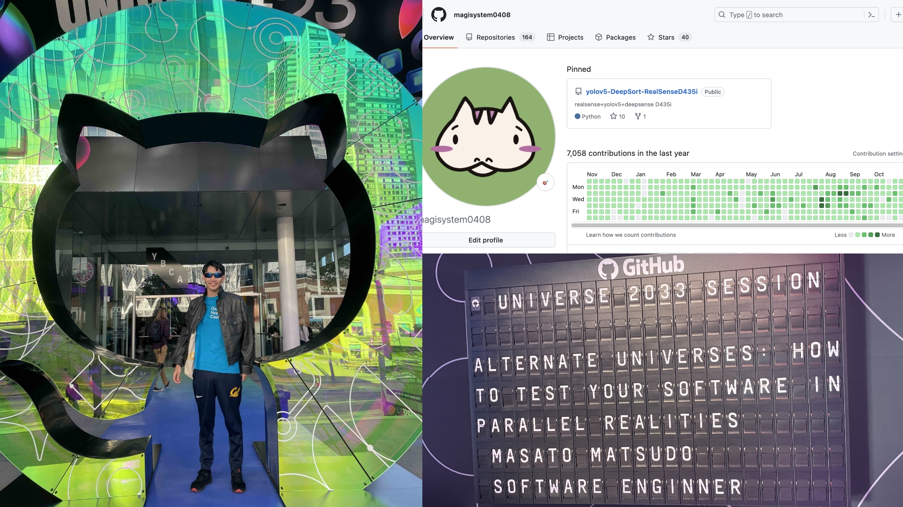
masato matsudoと申します。 毎日contributeするを心がけています。
経歴等を全部書くと長くなるので、割愛しますが、今は、株式会社大阪ヒートクールでEdge & Software Engineer
や、別のスタートアップでVPOE、Mobile開発、kubernetesをやっています。
好きな事は、kubernetesのPodをRolloutすることで、
`k rollout deploy <deployment名> -n <namespace名>`をするのが好きです。

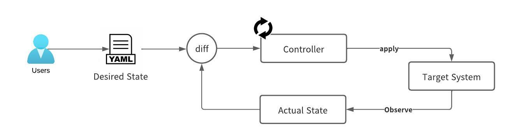

好きなアーキテクチャは、元々、電気電子工学学科(正確には、総合数理学部)ということもあり、「フィードバック制御」に似た
制御をSoftwareに導入する流れが好きで、その流れの中で、kubernetesのざっくりcontrollerで使用されてる
「Reconciliation Loop」という現在の自分の状態と、理想の状態を比較して、理想の状態になるように、設定するという考え方が
とても好きです。

https://www.oreilly.com/library/view/97-things-every/9781492050896/ch73.html

さて、Github Universeに戻りたいと思います。

### Unique of the Unique

### 「LLM + GitHub連携による、セキュリティやCI/CDワークフローの自動化」

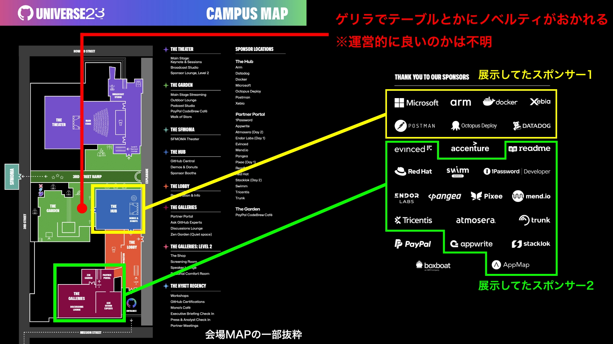

Github Universeでは、おそらくスポンサーのブースが設けられ、大きく3つのグループが存在しました。

正確には公式的には、2つのグループですが、
- スポンサー1：ガッツリBackUpしてくれてる企業
- スポンサー2: バックアップ
- ???: ゲリラで出現する(運営的に良いのかは不明)

の大きく3つ存在しました。

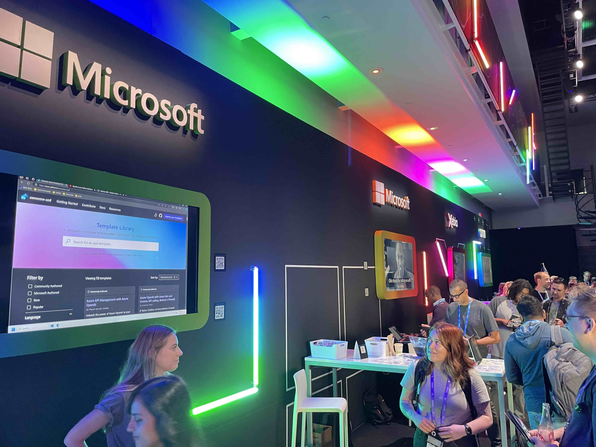
画像のスポンサー1が、全面的にBackUpしてる企業で、合計7社で、大体聞いた事がある 会社さんが並んでいました。

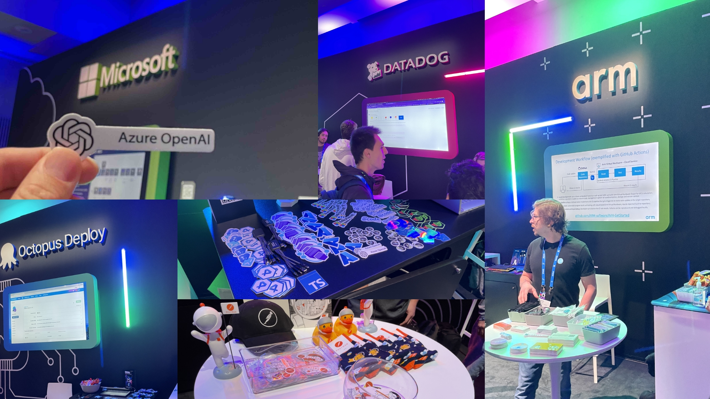

スポンサー1のところのテーマは、そもそも開発体験のリードといったところでしょうか。
主に、セキュリティの自動化や、Docker Imageのセキュリティに以上があるかのチェックを自動化を中心とするテーマがメインだったと思っています。
どちらかというと、スポンサー1は、名前をより売る為に、Github Universeのメインフロアを使って、自社の製品を知ってもらうという感じでした。

- Docker

https://www.docker.com/

- DataDog

https://www.datadoghq.com/ja/lpg/?utm_source=advertisement&utm_medium=search&utm_campaign=dg-google-brand-ww&utm_keyword=%2Bdatadog&utm_matchtype=b&utm_campaignid=9551169254&utm_adgroupid=95325237782&gad_source=1&gclid=CjwKCAiAxreqBhAxEiwAfGfndMn0dnfssBUurjYXEFSbVTRnOtyGp4TX6wjFVo7_S0pMtoi4o4tF_hoCBAQQAvD_BwE

- PostMan

https://www.postman.com/

- octopus Deploy

https://octopus.com/

- microsoft
  
https://www.microsoft.com/en-us/

- xebia

https://xebia.com/

- arm

https://www.arm.com/

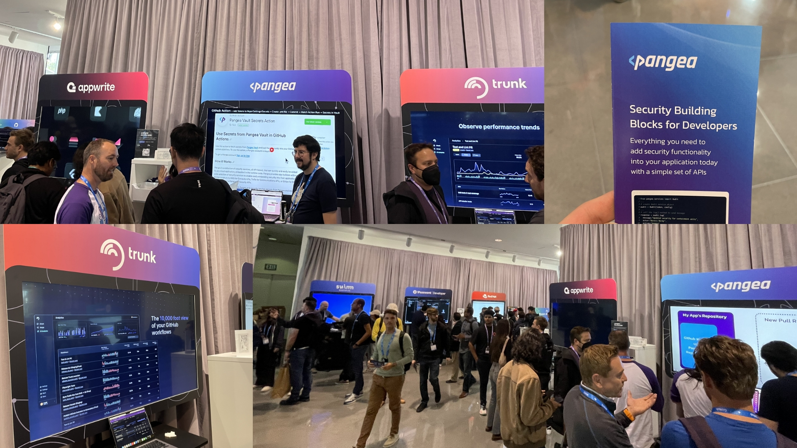

スポンサー2については、利用ユーザーはかなりいるが、少しマイナーでもあるといった企業が立ち並んでいました。
(マイナーといっていいのかは不明ですが。)

私個人的に、このスポンサー2のテーマについては、今後の開発のトレンドになるのではないかと思いました。

#### Saasとリポジトリを解析して、コードをリファクタリングしてPull Requestを用いてSuggestしてくれるサービスが増加するのではないか？

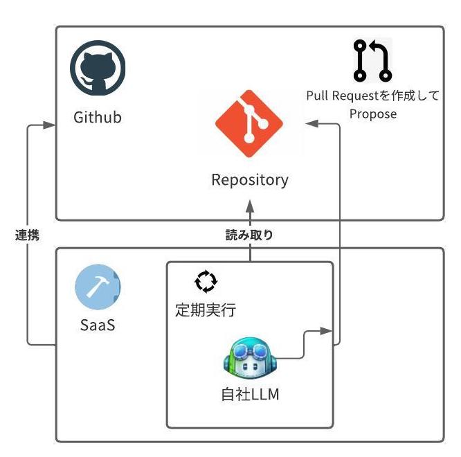