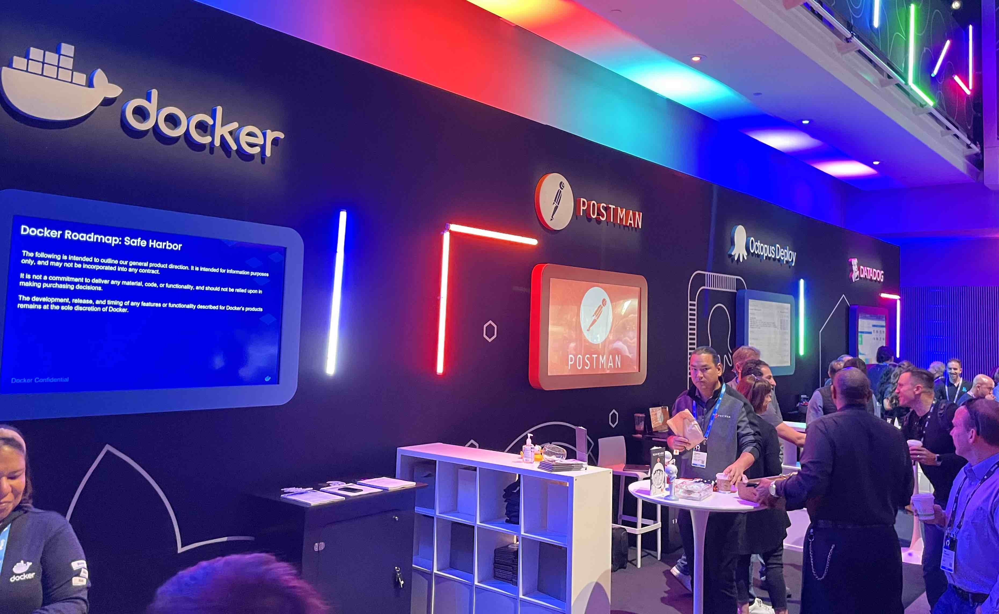

# 続・GitHub Universe 2023 現地会場 参加・今後のIT市場考察レポート GitHub カンファレンスレポート at サンフランシスコ [2023/11/08~2023/11/09]


私は、2023年 11/08~11/09にサンフランシスコでGithub最大の開発者カンファレンスに参加してきました。
この記事では、 カンファレンス自体の具体的なgithubのアップデート機能についてというよりか、現地の実際に
展示してる、ITスタートアップの傾向と今後の市況予想について、感じてきたことについてを書いていきます。


こちらの記事は、考察がメインになりますので、実際のカンファレンスの様子につきましては、別途以下のリンクにて
紹介しております。

> https://qiita.com/magisystem0408/items/de20bebfd891b3c5ba14


このGithub Universeの前々日に、OpenAIのカンファレンスが同じサンフランシスコで行われていて
大きくLLM(ほぼCopilotですが)に関する発表があるとGithub CEOもX(twitter)で囁いていました。

https://twitter.com/ashtom/status/1712711168207577262?t=8B5pXK1yrFC3QvIsVGO4LQ&s=19

## 今回の「LLM + GitHub連携による、セキュリティやCI/CDワークフローの自動化」がテーマだと思った

今回カンファレンスで「CopilotのUpdate」が大きな話題になっていましたが、私は、それよりも、
LLMとGitHub連携による、セキュリティやワークフローの自動化についてが、今後の開発のトレンドになると感じました。


また、今回のCopilotのUpdateについても触れたいと思います。

### Hello World Masato!


masato matsudoと申します。 毎日contributeするを心がけています。
経歴等を全部書くと長くなるので、割愛しますが、今は、株式会社大阪ヒートクールでEdge & Software Engineer
や、別のスタートアップでVPOE、Mobile開発、kubernetesをやっています。
好きな事は、kubernetesのPodをRolloutすることで、
`k rollout deploy <deployment名> -n <namespace名>`をするのが好きです。


好きなアーキテクチャは、元々、電気電子工学学科(正確には、総合数理学部)ということもあり、「フィードバック制御」に似た
制御をSoftwareに導入する流れが好きで、その流れの中で、kubernetesのざっくりcontrollerで使用されてる
「Reconciliation Loop」という現在の自分の状態と、理想の状態を比較して、理想の状態になるように、設定するという考え方が
とても好きです。

https://www.oreilly.com/library/view/97-things-every/9781492050896/ch73.html

さて、Github Universeに戻りたいと思います。

### Unique of the Unique


サンノゼ・サンフランシスコ・サンタクララは基本、天気が良く、快晴である事が
多く野外に何か置いてあることが多いような気がします。 日差しが強く何も、遮るものがなかったりするので、サングラスはほぼ必須です。
カンファレンス中の2日とも、快晴で、野外ステージが役立っていました。Octocat(Gitネコ)のパネルカード、
AKSかAzureで動いてるContainerの形をした、椅子、座ったらいい感じにfitするソファが地面にどさりと置かれていたり、


Octocatドーナッツアートや、マカロン、ポテトチップスなどの食べ物がfree置かれていたり、味は一旦置いておいて、
会場に入場するだけで$450ドル(7~8万円ぐらい?)の正直高いと思ったのですが、獲得した経験と比べたら、意外と
それだけしても十分な価値があると感じました。 こうゆうアメリカ的表現の仕方が日本にはなさそうな感じでとても好きです。

#### Let's hacking!

カードに、ハッキングするお題が書かれていて、その回答をロッカーの暗証番号に入れて鍵を開ける方式のアトラクション?がありました。
多分ハッキングに成功してロッカーを開けられると景品がもらえるのかなと思います。私も挑戦しましたが、開錠できませんでした。
確か、Realmのテストケースに関しての問題だった気がします。


### (LLM + Github) = Security || CI/CD Workflow Automation


「LLM + GitHub連携による、セキュリティやCI/CDワークフローの自動化」
Github Universeでは、おそらくスポンサーのブースが設けられ、大きく3つのグループが存在しました。

正確には公式的には、2つのグループですが、

- スポンサー1：ガッツリBackUpしてくれてる企業
- スポンサー2: バックアップ
- ???: ゲリラで出現する(運営的に良いのかは不明)

の大きく3つ存在しました。




画像のスポンサー1が、全面的にBackUpしてる企業で、合計7社で、大体聞いた事がある 会社さんが並んでいました。


スポンサー1のところのテーマは、そもそも開発体験のリードといったところでしょうか。
主に、セキュリティの自動化や、Docker Imageのセキュリティに以上があるかのチェックを自動化を中心とするテーマがメインだったと思っています。
どちらかというと、スポンサー1は、名前をより売る為に、Github Universeのメインフロアを使って、自社の製品を知ってもらうという感じでした。


スポンサー2については、利用ユーザーはかなりいるが、少しマイナーでもあるといった企業が立ち並んでいました。
(マイナーといっていいのかは不明ですが。)

私個人的に、このスポンサー2のテーマについては、今後の開発のトレンドになるのではないかと思いました。

#### Saasとリポジトリを解析して、コードをリファクタリングしてPull Requestを用いてSuggestしてくれるサービスが増加するのではないか？


あるSaaSとGithubのリポジトリを連携させて、連携させることで、Saasの中に搭載されてるLLMが、より良いコードの書き方などを生成して
Pull Requestを作成して、Userにsuggestしてくれるというサービスが増えていくのではないかと思いました。

私は、とあるプロジェクトで、renovateと今回のスポンサーで展示されていた、mend.ioを使用して、
terraformで書かれてるproviderが常に最新かをcheckしてくれるような、ワークフローを導入しています。
githubのdependantBotは、terraformのversionまでは監視してくれるのですが、terraformのなかのproviderまでは、監視してくれません。
これらはrenovate+mend.ioを使用すると、定期実行でリポジトリをチェックしてproviderを使用しているかをチェックしてくれて常に最新にgcp providerなどが保てます。

https://github.com/renovatebot/renovate

```terraform
terraform {
  #...省略
  required_providers {
    google = {
      source  = "hashicorp/google"
      version = "4.80.0" #TODO: renovateでこのversionを監視してくれる。
    }
    sentry = {
      source  = "jianyuan/sentry"
      version = "0.11.2" #TODO: renovateでこのversionを監視してくれる。
    }
  }
}
```


1日目に展示していた、企業でpixee.aiというサービスは、python,javaなどで書かれた、github repositoryとpixee.aiを連携させて
pixeeが、コードの書き方でセキュリティに問題がないかをチェックしてPullRequestを作成してサジェストしてくれるというサービスを展示していました。
おそらく、上記画像のような自社LLMまたは、chatGPT+自社のプロンプトがサービス内で定期実行されてるのかと思います。

https://www.pixee.ai/

実際に開発者がコードを書いてる時、コード全体のセキュリティを考えながらコードを書いたり、最新のコードの書き方に追従させるのは
とても大変だと思っています。このようなGitRepositoryと連携してコードメンテナンスがしやすくなると開発者の負担が減るのではないかと思いました。
...その分、サービスに対してのセキュリティとかは心配なので、検証または、オンプレなどの展開方法を検討する必要がありそうではありますが...

### Thank you! Github Universe 2023


2日間見て書いて投稿して歩いてる時にコードを頭で設計して、夜は記事を見直しつつ、
日本企業の会議をして、足と眠気が限界値を超えながらrunningさせていましたが、
(途中で頭と足を`kubectl rollout restart`したくなりましたが、)、最速で伝えるを意識して
投稿をしました。サンフランシスコでのカンファレンス参加は初だったので、とても良い経験になりました。


とCopilotにSuggestされていますが、ここはRejectをして、次回も世界で行われるカンファレンスに参加して、いち早く、最速で
現地でどのようなことが起きてるのかを伝えていきたいと思います。

### San Francisco at Ai Town


サンフランシスコで、自動運転の車が増えたとは聞いていたのですが、
実際に人を乗せて走ってるのは、見たことがなかったのですが、 実際に何台もの自動運転の車が走っていて、どうやら`waymo`という会社が、サンフランシスコで自動運転の車を走らせているようでした。
乗るには、invitation codeが必要みたいで乗れなかったですが、アプリ自体はインストールできるみたいです。

https://waymo.com/


この車体、見覚えがあるなぁと思ってたら、今年のCES2023で展示されてた車体でした。
実際に走ってるのは画像の左上ですが、トラック型、ワゴン型などを展示していたので、
これらもその内走り出すのではないかなと思いました。
去年サンフランシスコに行ったときは、cruiseという会社が、自動運転の車を走らせていたのですが、
一回も見ませんでした。

https://getcruise.com/

### Palo Alto and Mountain View


### My Hope for the Future


### スポンサー
> https://strategy-jp.com/